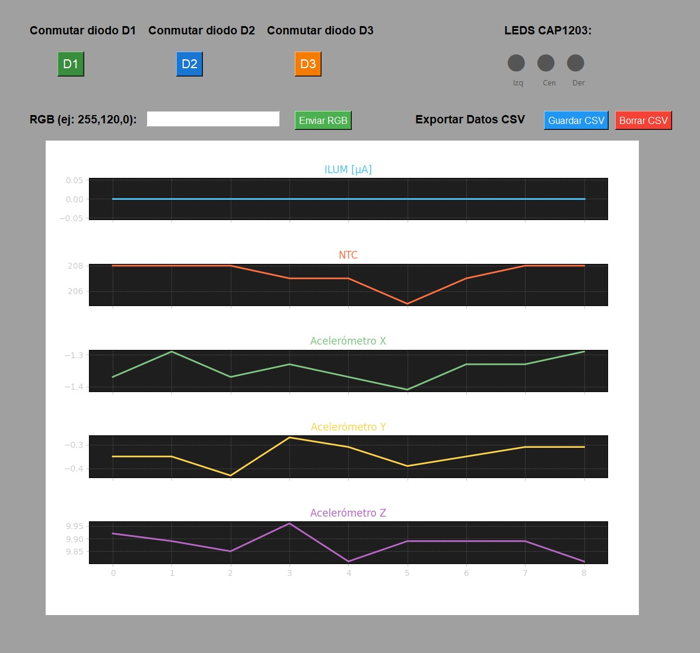

# Dashboard de Sensores con ESP32 y Python

Este proyecto muestra una interfaz gráfica en Python (Tkinter) que se comunica con un ESP32 para visualizar en tiempo real los datos de varios sensores:

- Sensor de luz (LDR)
- Sensor de temperatura (NTC)
- Acelerómetro ADXL343 (ejes X, Y, Z)
- Sensor capacitivo CAP1203 (3 zonas táctiles: izquierda, centro, derecha)

La interfaz permite:
- Controlar tres LEDs y un LED RGB mediante comandos enviados al ESP32.
- Ver gráficas actualizadas de cada sensor.
- Guardar los datos en un archivo CSV.

